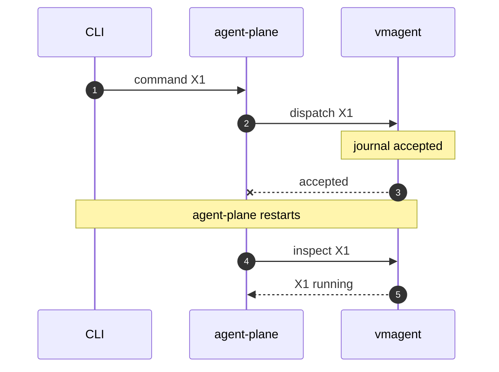
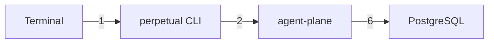

# Syntax that renders cleanly as text

Verified 2026-09-20 with mermaid-ascii `v0.0.0-20260908213847-5f00e3d9ac9f` and PlantUML `1.2026.8`.
Re-verify after changing either version in `scripts/setup.sh`.

## Mermaid sequence diagrams



- `->>` solid request, `-->>` dotted reply, `-x` or `--x` a lost message (drawn with a cross).
- `Note over A` is work one actor does alone; `Note over A,B` spanning all columns works as a banner for crashes and restarts.
- `autonumber` numbers messages only; notes stay unnumbered.
- `alt` / `else` / `loop` / `end` blocks render as labelled frames.
- Give long or hyphenated names an alias: `participant AP as agent-plane`.
- Avoid `#` and `;` in labels: real Mermaid treats them as entity codes and statement ends. Write `output 1..3`, not `output #1..#3`.
- Width grows with participant count and the longest label between neighbours. Six participants fit in about 100 columns when labels stay under roughly 16 characters.

## Mermaid graphs



- Options: `-x` horizontal gap, `-y` vertical gap, `-p` padding inside boxes, `-a` plain ASCII. `-x 4 -y 1 -p 0` is a compact starting point.
- Use `graph LR` for fan-out from a hub; TD grows very tall there.
- Use `graph TD` for anything containing a cycle. A six-node TD graph with a back-edge and a skip edge rendered cleanly.
- In LR, the first-declared child shares its parent's row. Declare first the child that has its own downstream edge, or that grandchild lands far away on a long connector.
- Keep edge labels to a number or one or two words, and explain numbers in a key under the diagram.
- Labels are single-line; there is no `<br>` support.

Known failures, all observed:

- `subgraph` misplaces nodes and detaches edges. Do not use it; show grouping in a table or in the node label.
- A cycle in `graph LR` corrupts a node label (`real a┬apters`) and detaches the return arrow; with `-x 4 -y 1 -p 0` it crashes mermaid-ascii (`index out of range`). Use `graph TD`.
- An unlabelled edge renders as a bare arrowhead between boxes; it is connected, only short.
- More than about eight nodes, or long edge labels, produce diagrams over 150 columns.
- Piping output through `cut -c` breaks multi-byte characters; use `render.py`, which reports width itself.

## PlantUML

Only sequence diagrams work in text mode (`-utxt` Unicode, `-ttxt` ASCII).
Component, class, and state diagrams need Graphviz, which this host lacks, and look poor as text anyway.
`== divider ==` crashes the text renderer in 1.2026.8; use a spanning note instead.
Participants declared `"agent-plane" as AP` are drawn with the alias, so skip aliases.
Prefer Mermaid unless a PlantUML-only feature is essential.

## Embedding

```markdown
<!-- draw-visual: diagrams/3-topology.mmd -->
```text
(rendered output; replaced by render.py --update)
```
```

The marker path is relative to the Markdown file.
`render.py --check FILE.md` fails when an embed is stale or wider than `DRAW_VISUAL_MAX_WIDTH` (default 110).
